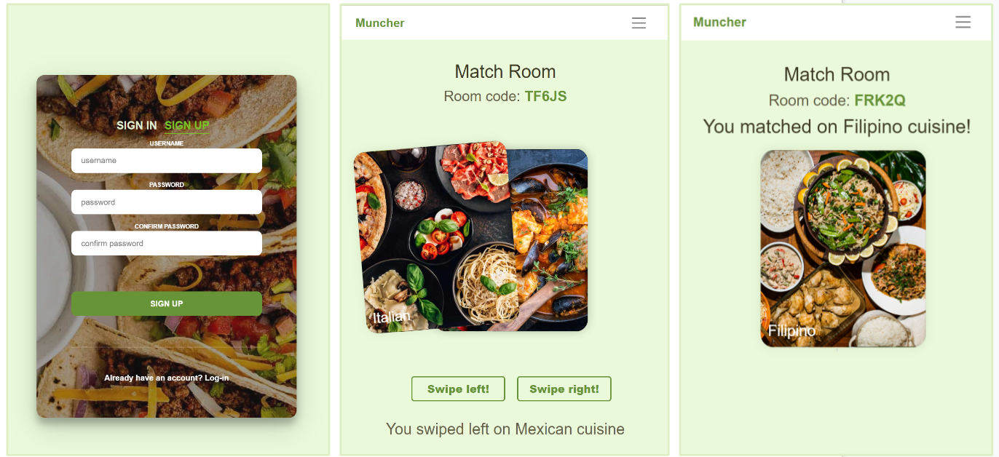

# Muncher | Swipe Right - on Your Next Meal
Like Tinder, but to help indecisive people pick where to eat!

## Project Video

## Project Screenshot


## Features
* Authentication and authorization: Allows users to sign-in or sign-up and have an account saved to the local database.
* Create match room: User can create a new match room and share their room code for one other person to join.
* Join match room: User can join a match room with a room code shared to them.
* Interactive card swipe: Card swiping left or right functional or user can also click on the corresponding buttons.
* Instantaneous cuisine matching: Displays matched cuisine instantly after both users swipe right on the same cuisine. 

## Getting Started
### Python Commands
*Here's a bunch of shell commands to do various python things. You should run these in the base folder of the repo.

### Install Dependency

```bash
# This installs the dependency and makes it available to your code
pip3 install <dependency>

# This updates the dependencies.txt file
pip3 freeze > requirements.txt
```

### Install dependencies listed in `requirements.txt`

You should do this whenever `requirements.txt` changes. If you don't do it and you don't have issues, you're fine!

```bash
# Muncher
pip3 install -r requirements.txt
```

### Run Flask app

```bash
flask run
```


### Updated running instructions

In one terminal, run:
```bash
flask --debug run
```

In another one, run:
```bash
npm run start
or
npm start --prefix client
```

Opening http://localhost:5000 will load a functional app that successfully handles reloading.